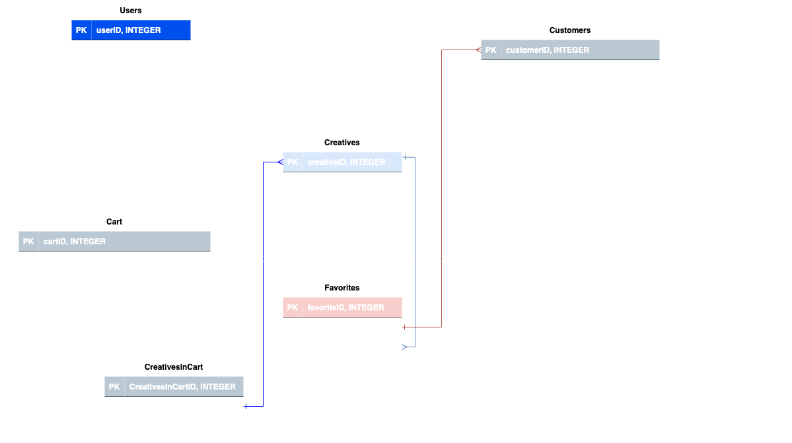

# Creas Crave Backend
*part of full stack project using express, body-parser, cors, middleware, sequelize, models, endpoints, openWeatherAPI, and process.env.PORT for dynamic port with port 4400 backup ... required modest work in package.json (i.e. add engines)*
 
 
**HOW WORKS**
- models manage user-inputted/activated content - database aka db, Cart, Creatives, CreativesInCart, Customers, Favorites, Subscribers, and Users (all capitalized per React App components) 
- middleware implements async/await with if/else statements to authenticate email and password with error return as backup 
- GET aka server.get() displays **a)** hello message in browser to indicate backend running and **b)** dynamic weather information called from openWeather API 
- POST aka server.post() **a)** requires zip code length, **b)** checks database to ensure email and password are known and returns errors when they are not, and **c)** adds subscribers and favorites
- process.env.PORT dynamically implements port and defaults to port 4400 as backup 
- server.listen() displays confirmaton port is running and where 
 
**NOTE:** server.js is per what name the file that contains this backend code - i.e. same as app.js

**NEXT STEP**  
1. fully wire backend
2. implement environment variables for database(s)
3. maintain full stack code

###### <a href="https://www.latoniamertica.dev/creas-crave-capstone/" target="_blank">visit Creas Crave Capstone Powered by This Backend by La'Tonia Mertica</a>
 

 

##### FIRST NAME: La'Tonia Mertica
###### note_1: pronounced *luh tone yuh merr treece*
 

## MY BACK STORY
 
I went into code because I saw code as a gateway to better options, informed risk-taking, and outcomes. 
 
 
My fantasies on a better life are nothing special. A better life, life quality, and sense of self. A life during which I create opportunities for the substance of my existence. A life I enthusiastically own. A life that welcomes, entertains, and bows to parts of myself I've envisioned embracing for too long - focusing on non-me things out of a sense of duty, and obligation, and misaligned timing. Nothing special. Still, my own, and true difference.  
 
 
When I was notified I was accepted into Hack Upstate full stack javascript code/web dev bootcamp Careers in Code, I knew my life was changed. 
 
 
Far from perfect, and likely destined to never truly achieve the level and status I fantasize on, I code every day. I apply my best self. Dwell in the moment - to moment. Never forget how hard life has been at times. And that debatably I shouldn't be alive today. But I am. Building out the purpose of my life is a lot to do - and I still don't have authenticated clarity on it. 
 
 
Still, it involves vigorous exceptional communication - and, coding is now part of my fierce means to say some things.
 
 

